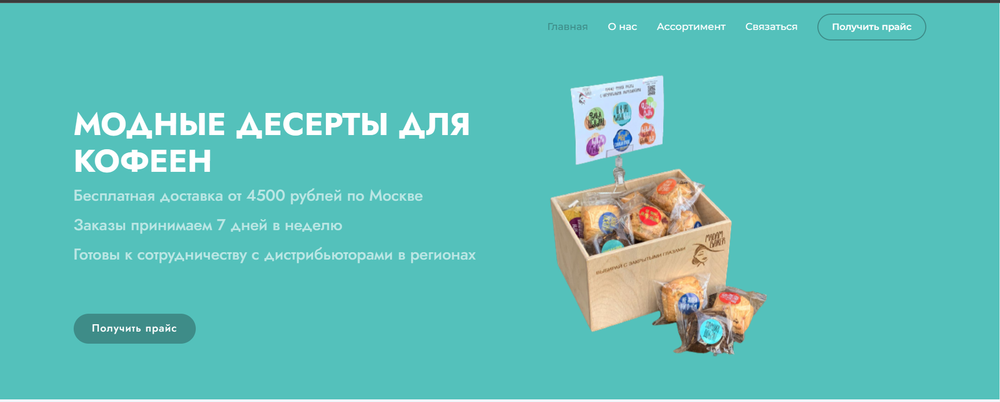
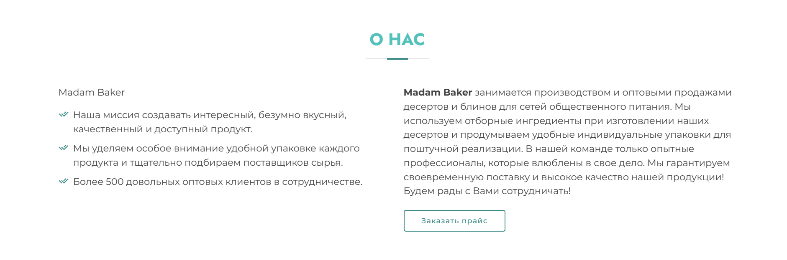
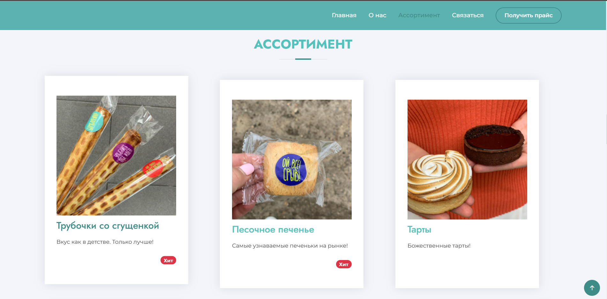

# Пояснительная записка:

- Заставка

- О нас

- Ассортимент
    * Картинки
    * Десерты

## Файлы

* [main.py](https://github.com/renat2006/lego_master_and_student/blob/Renat/main.py)    
  ___Это основной файл, в нём происходит запуск игры и функций___
* [constants.py](https://github.com/renat2006/lego_master_and_student/blob/Renat/logic/constants.py)    
  ___Здесь хранятся основные переменные и константы, для удобного доступа из других файлов___
* [in_game_menu.py](https://github.com/renat2006/lego_master_and_student/blob/Renat/logic/in_game_menu.py)    
  ___Инвентарь___
* [load_image.py](https://github.com/renat2006/lego_master_and_student/blob/Renat/logic/load_image.py)     
  ___Загрузка изображений___
* [menu.py](https://github.com/renat2006/lego_master_and_student/blob/Renat/logic/menu.py)    
  ___Меню и настройки___
* [start_screen.py](https://github.com/renat2006/lego_master_and_student/blob/Renat/logic/start_screen.py)    
  ___Стартовый экран___
* [load_design.py](https://github.com/renat2006/lego_master_and_student/blob/Renat/load_design_level1.py)    
  ___Загрузка уровня___

## Классы

`Bullet` - Класс для работы с патронами оружия  
`Buttons` - Класс генерирования кнопок
`Inventory` - Класс, отвечающий за инвентарь игрока
`Input_field` - Класс генерирования стартового поля  
`Loot` - Класс отображения бонусов  
`Settings` - Класс, отвечающий за настройки
`Particle` - Класс анимации бонусов
`Player` - Главный класс игрока
`Settings_fon` - Класс оформления настроек
`Text` - Класс текстовых вставок
`Tile` - Класс предметов и препятствий

## Библиотеки

___Все используемые библиотеки находятся в
файле [requirements.txt](https://github.com/renat2006/projet_ya_lc/blob/master/requirements/requirements.txt)___

* [Pygame](https://en.wikipedia.org/wiki/Pygame)
